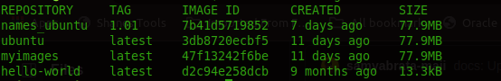

## Docker

## What is Docker?
Docker is a container platform that allows you to build,test and deploye applications quickly. A Developer defines all the applications and it's dependencies in docker file which is then used to build Docker images that defines a Docker container. Doing this ensure that your applications will run in any environment.

## Docker Images

## Architechture of Docker

Docker user client-server architechture.The Docker client talks to the Docker daemon, which does the heavy lifting of building, running, and distributing your Docker containers. The Docker client and daemon can run on the same system, or you can connect a Docker client to a remote Docker daemon

