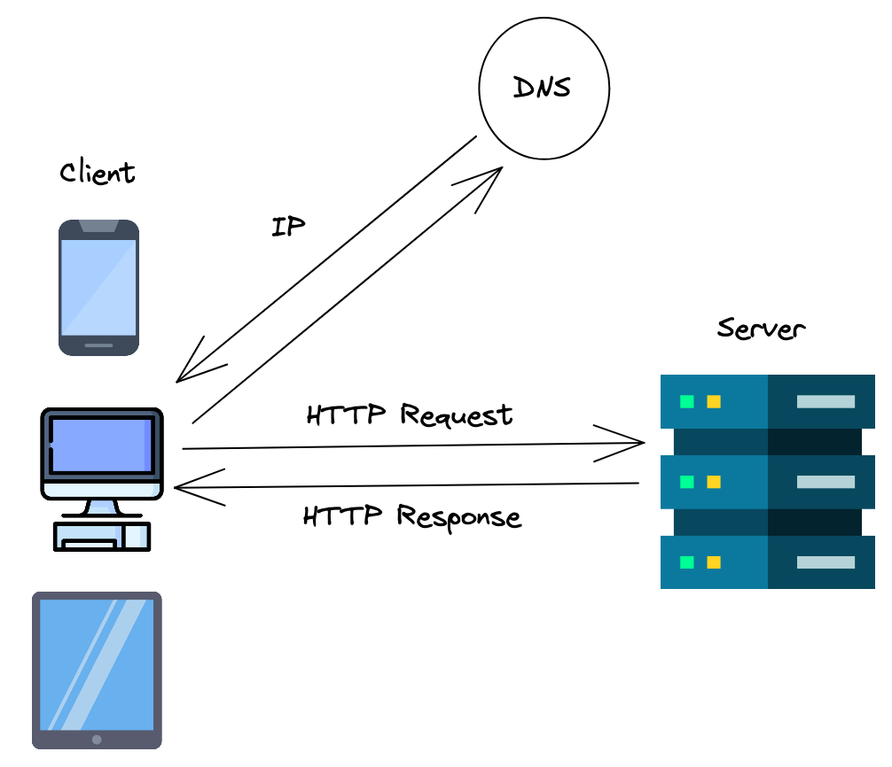
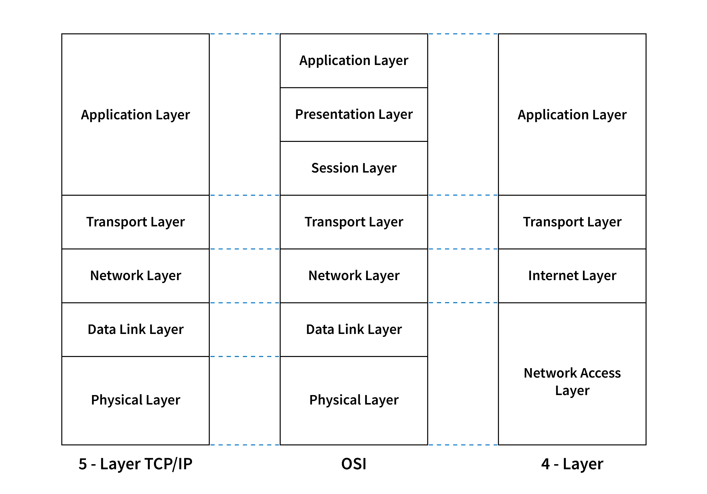

## What is computer Network?
A computer network is a system that connects multiple computers and devices to share resources and information.

## What is client and server?
  - Client:- A client is a program that run on the local computer and requesting service from server.
  - Server:- A server is a program that run on remote computer and send response to client.

  

  ## Protocols:
  *Protocols are some set of rule how data will send over network.*
   - TCP
   - UDP
   - HTTP

## Ports
A port is a virtual point where network connections start and end. Ports are software-based and managed by a computer's operating system.

## IP Address
IP is a protocol or set of rules for routing and addressing packets of data so they can reach to the correct destination.

## Structure of Network
### <a href="https://www.cloudflare.com/learning/ddos/glossary/open-systems-interconnection-model-osi/">OSI Model</a> (Open system Interconnection):
*OSI model is a conceptual framework that divices network communications into seven layers.*

### TCP/IP layer:

