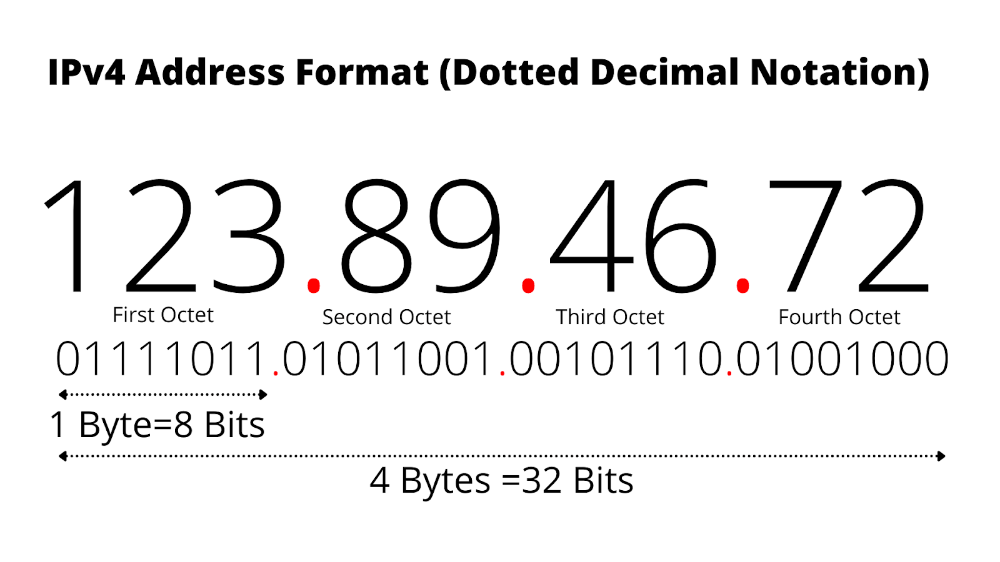

## What is computer Network?
A computer network is a system that connects multiple computers and devices to share resources and information.

## What is client and server?
  - Client:- A client is a program that run on the local computer and requesting service from server.
  - Server:- A server is a program that run on remote computer and send response to client.

  

  ## Protocols:
  *Protocols are some set of rule how data will send over network.*
   - TCP
   - UDP
   - HTTP
   - DHCP
   - SMTP
   - POP3 & IMAC
   - SSH
   - VNC

## Ports
A port is a virtual point where network connections start and end. Ports are software-based and managed by a computer's operating system.

|Port Number| Process | Uses |
|:--:|:--:|:--:|
|80 | HTTP | |
|443| HTTPs| |
|3306| MySQl | |

## IP Address
IP is a protocol or set of rules for routing and addressing packets of data so they can reach to the correct destination.

## Structure of Network
### <a href="https://www.cloudflare.com/learning/ddos/glossary/open-systems-interconnection-model-osi/">OSI Model</a> (Open system Interconnection):
*OSI model is a conceptual framework that divices network communications into seven layers.*

### TCP/IP Model:

### DNS (Domain Name system):
Domain Name System (DNS) is a distributed database that translates domain names into IP addresses.

### <a href="https://www.cloudflare.com/learning/ddos/glossary/user-datagram-protocol-udp/">UDP (User Datagram Protocol)</a>:
The User Datagram Protocol (UDP) is a communication protocol primarily used for fast, connectionless transmission of data over networks.

- UDP header fields include:
  - Source port
  - Destination port
  - Packet length (header and data)
  - checksum 

### <a href="https://www.javatpoint.com/tcp" target="_blank">TCP (Trasmission control protocol)</a>:
TCP is a transport layer and connection oriented protocol that means its establish the connection befor start communication between devices.

