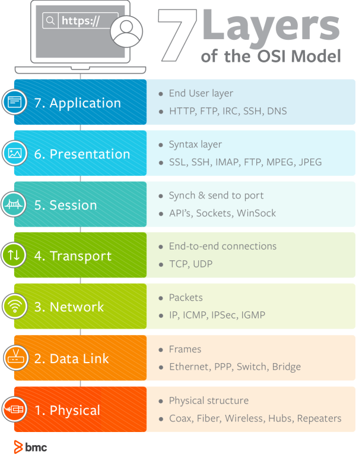

## What is computer Network?
A computer network is a system that connects multiple computers and devices to share resources and information.

## What is client and server?
  - Client:- A client is a program that run on the local computer and requesting service from server.
  - Server:- A server is a program that run on remote computer and send response to client.

   

  ## Protocols:
  *Protocols are some set of rule how data will send over network.*
   - TCP
   - UDP
   - HTTP

## Ports

## IP Address

## Structure of Network
### OSI Model (Open system Interconnection)

